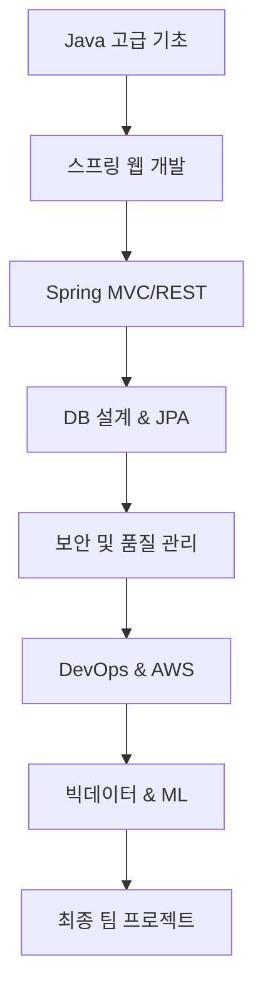

# 백엔드 고급 개발자 양성과정 상세 커리큘럼

## 강의 목표
- 실무 중심의 웹 개발 역량 강화
- 지능형 서비스 구현

## 총 강의 기간
- 6개월 과정 (총 약 24주)

## 주차별 커리큘럼
### 1~2주차: 개발 환경 설정 및 Java 고급 기초
- IntelliJ/Eclipse 세팅, Git 실습, Java 최신 문법, 객체지향 설계 복습

### 3~4주차: 웹 기초 및 스프링 핵심
- HTTP, RESTful, 스프링 IoC/DI, Spring Boot 시작

### 5~6주차: Spring MVC와 데이터 흐름
- MVC 패턴, Thymeleaf, JSON 송수신, REST API 설계

### 7~8주차: 데이터베이스 설계 및 MySQL
- 관계형 DB, MySQL SQL, Spring Boot 연동, CRUD 실습

### 9~10주차: JPA를 활용한 ORM 구현
- JPA/Hibernate, Spring Data JPA, 연관관계 매핑

### 11~12주차: JPA 심화 및 성능 튜닝
- 복합 키, JPQL, QueryDSL, 트랜잭션, N+1 문제 해결

### 13~14주차: 스프링 시큐리티 및 인증
- Spring Security, JWT, OAuth2, 권한 관리

### 15~16주차: 테스트 및 품질 관리
- JUnit, Mockito, 예외 처리, 코드 리팩토링

### 17~18주차: DevOps 기초와 CI/CD
- Git 전략, Jenkins CI/CD 파이프라인

### 19~20주차: 클라우드(AWS) 환경 구성
- AWS EC2, RDS, S3, 리눅스 서버, Spring Boot 배포

### 21~22주차: 빅데이터 및 머신러닝 적용
- 데이터 분석, Python ML 적용

### 23~24주차: 최종 팀 프로젝트
- 실무형 프로젝트 기획, 개발, 배포, 발표

## 사용 기술 스택
- Backend: Java, Spring Boot, JPA
- DB: MySQL, H2
- DevOps: GitHub, Jenkins, AWS
- Tools: IntelliJ, Postman, Lombok

## Mermaid 흐름도

